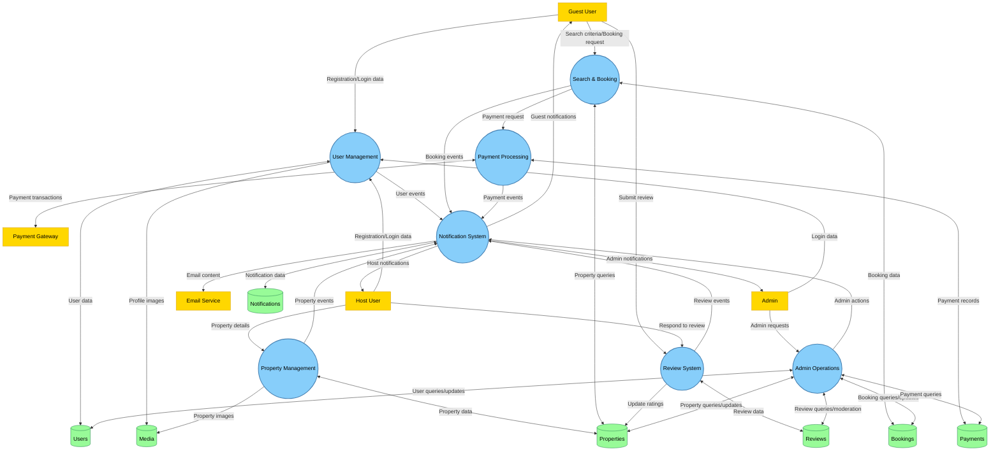

# Airbnb Clone Data Flow Diagram (DFD)

This directory contains a Data Flow Diagram (DFD) that illustrates how data moves through the Airbnb Clone backend system. The diagram visualizes the flow of information between external entities, processes, and data stores.

## Overview

A Data Flow Diagram (DFD) is a graphical representation of how data flows through an information system. It shows:

- External entities that interact with the system
- Processes that transform data
- Data stores where information is kept
- Data flows that connect these components

The DFD for the Airbnb Clone backend system maps out the core data flows for key functionalities including user management, property listings, bookings, payments, reviews, and notifications.

## ASCII Representation

Below is an ASCII representation of the Data Flow Diagram:

```
+----------------------------------------------+
|           AIRBNB CLONE DATA FLOW DIAGRAM     |
+----------------------------------------------+

EXTERNAL ENTITIES:
-----------------
[Guest User]     [Host User]     [Admin]     [Payment Gateway]     [Email Service]
     |               |              |               |                    |
     |               |              |               |                    |
     v               v              v               v                    v

PROCESSES:
---------
                  +-------------------+
                  |  User Management  |<-------------+
                  | (Register, Auth,  |              |
                  |     Profile)      |              |
                  +-------------------+              |
                     |         |                     |
                     |         |                     |
                     v         v                     |
+-------------------+    +--------------------+      |
| Property Management|    |  Search & Booking |      |
| (Create, Edit,     |    | (Search, Filter,  |      |
|  Delete, Avail.)   |    |  Book, Cancel)    |      |
+-------------------+    +--------------------+      |
        |                      |        |            |
        |                      |        |            |
        v                      v        v            |
+-------------------+    +--------------------+      |
|   Review System   |    | Payment Processing |<-----+
| (Submit, Respond, |    | (Process, Refund,  |      |
|      Rate)        |    |      Payout)       |      |
+-------------------+    +--------------------+      |
        |                         |                  |
        |                         |                  |
        v                         v                  |
                  +-------------------+              |
                  |   Notification    |              |
                  |      System       |              |
                  +-------------------+              |
                           ^                         |
                           |                         |
                           |                         |
                  +-------------------+              |
                  |  Admin Operations |<-------------+
                  | (Manage, Moderate,|
                  |      Report)      |
                  +-------------------+

DATA STORES:
-----------
[Users]  [Properties]  [Bookings]  [Payments]  [Reviews]  [Notifications]  [Media]
```

## Key Components in the DFD

### External Entities

1. **Guest Users** - Users who browse listings and make bookings
2. **Host Users** - Users who create and manage property listings
3. **Admin Users** - System administrators who manage the platform
4. **Payment Gateway** - External payment processing service
5. **Email Service** - External notification service

### Processes

1. **User Management**
   - User Registration
   - Authentication
   - Profile Management

2. **Property Management**
   - Create/Edit/Delete Listings
   - Manage Property Availability
   - Upload Property Images

3. **Search and Booking**
   - Property Search and Filtering
   - Booking Creation
   - Booking Cancellation

4. **Payment Processing**
   - Process Guest Payments
   - Issue Refunds
   - Manage Host Payouts

5. **Review System**
   - Submit Reviews
   - Respond to Reviews
   - Calculate Ratings

6. **Notification System**
   - Generate Notifications
   - Send Emails
   - Display In-app Notifications

7. **Admin Operations**
   - User Management
   - Content Moderation
   - Report Generation

### Data Stores

1. **Users** - Stores user account information
2. **Properties** - Stores property listing details
3. **Bookings** - Stores booking information
4. **Payments** - Stores payment transaction records
5. **Reviews** - Stores user reviews and ratings
6. **Notifications** - Stores notification messages
7. **Media** - Stores property images and user profile photos

## Data Flows

The diagram illustrates several key data flows, including:

1. **User Registration Flow**
   - User submits registration data
   - System validates and stores user information
   - System generates authentication credentials

2. **Property Listing Flow**
   - Host submits property details
   - System validates and stores property information
   - Property becomes available in search results

3. **Booking Flow**
   - Guest searches for properties
   - Guest selects property and dates
   - System checks availability
   - Guest confirms booking
   - System processes payment
   - System notifies host and guest

4. **Payment Flow**
   - Guest initiates payment
   - System sends request to payment gateway
   - Payment gateway processes transaction
   - System records payment
   - System schedules host payout

5. **Review Flow**
   - Guest submits review after stay
   - System validates and stores review
   - Host receives notification
   - Host may respond to review
   - System updates property ratings

6. **Notification Flow**
   - System events trigger notifications
   - Notifications are stored and processed
   - Notifications are sent via email or displayed in-app

## Detailed Data Flow Descriptions

Below is a more detailed description of each data flow in the system:

### User Registration Flow
1. Guest/Host → P1.1: User registration data
2. P1.1 → D1: Store user data
3. P1.1 → P6.1: Trigger welcome notification
4. P6.1 → D6: Store notification
5. P6.2 → E5: Send welcome email
6. P6.3 → Guest/Host: Display welcome message

### Authentication Flow
1. Guest/Host/Admin → P1.2: Login credentials
2. P1.2 → D1: Verify credentials
3. P1.2 → Guest/Host/Admin: Authentication token

### Profile Management Flow
1. Guest/Host → P1.3: Profile update data
2. P1.3 → D1: Update user data
3. P1.3 → D7: Store profile image (if provided)
4. P1.3 → Guest/Host: Updated profile confirmation

### Property Listing Flow
1. Host → P2.1: Property details
2. P2.1 → D2: Store property data
3. Host → P2.2: Availability calendar
4. P2.2 → D2: Update availability
5. Host → P2.3: Property images
6. P2.3 → D7: Store images
7. P2.1 → P6.1: Trigger listing confirmation
8. P6.1 → D6: Store notification
9. P6.2 → E5: Send listing confirmation email
10. P6.3 → Host: Display listing confirmation

### Search and Booking Flow
1. Guest → P3.1: Search criteria
2. P3.1 → D2: Query properties
3. P3.1 → Guest: Search results
4. Guest → P3.2: Filter parameters
5. P3.2 → Guest: Filtered results
6. Guest → P3.3: Booking request (property, dates, guests)
7. P3.3 → D2: Check availability
8. P3.3 → D3: Create booking record
9. P3.3 → P4.1: Initiate payment
10. P4.1 → E4: Payment request
11. E4 → P4.1: Payment confirmation
12. P4.1 → D4: Store payment record
13. P3.3 → P6.1: Trigger booking notifications
14. P6.1 → D6: Store notifications
15. P6.2 → E5: Send booking confirmation emails (guest & host)
16. P6.3 → Guest/Host: Display booking confirmation

### Booking Cancellation Flow
1. Guest/Host → P3.4: Cancellation request
2. P3.4 → D3: Update booking status
3. P3.4 → P4.2: Initiate refund (if applicable)
4. P4.2 → E4: Refund request
5. E4 → P4.2: Refund confirmation
6. P4.2 → D4: Update payment record
7. P3.4 → P6.1: Trigger cancellation notifications
8. P6.1 → D6: Store notifications
9. P6.2 → E5: Send cancellation emails
10. P6.3 → Guest/Host: Display cancellation confirmation

### Review Flow
1. Guest → P5.1: Submit review and rating
2. P5.1 → D5: Store review
3. P5.1 → P5.3: Update property ratings
4. P5.3 → D2: Update property rating
5. P5.1 → P6.1: Trigger review notification
6. P6.1 → D6: Store notification
7. P6.2 → E5: Send review notification email to host
8. P6.3 → Host: Display review notification
9. Host → P5.2: Submit response
10. P5.2 → D5: Store response
11. P5.2 → P6.1: Trigger response notification
12. P6.1 → D6: Store notification
13. P6.2 → E5: Send response notification email to guest
14. P6.3 → Guest: Display response notification

### Payment Processing Flow
1. P4.1 → D4: Record guest payment
2. P4.1 → P4.3: Schedule host payout
3. P4.3 → D4: Update payment status
4. P4.3 → E4: Initiate host payout
5. E4 → P4.3: Payout confirmation
6. P4.3 → P6.1: Trigger payout notification
7. P6.1 → D6: Store notification
8. P6.2 → E5: Send payout notification email
9. P6.3 → Host: Display payout notification

### Admin Operations Flow
1. Admin → P7.1: User management request
2. P7.1 → D1: Query/update user data
3. Admin → P7.2: Content moderation request
4. P7.2 → D2/D5: Query/update property/review data
5. Admin → P7.3: Report generation request
6. P7.3 → D1/D2/D3/D4/D5: Query data
7. P7.3 → Admin: Generated report

## Levels of DFD

The data-flow.png diagram represents a Level 1 DFD, showing the main processes and data flows without going into excessive detail. This level provides a good balance between clarity and comprehensiveness.

## How to Use This Diagram

This DFD serves as a reference for developers to understand:

- How data moves through the system
- The key processes that transform data
- Where data is stored
- The interactions between different components of the system

It can be used for:

- System planning and design
- Identifying data requirements
- Understanding process dependencies
- Communication between technical and non-technical stakeholders

## Implementation Considerations

When implementing the system based on this DFD, consider:

- Data validation at each input point
- Secure data transmission between components
- Efficient data storage and retrieval
- Error handling for failed processes
- Transaction management for critical operations
- Scalability for high-volume data flows

## Mermaid Diagram Script

Below is a Mermaid script that can be used to generate an interactive data flow diagram:



### How to Use the Mermaid Diagram

1. Copy the entire Mermaid script above (including the ```mermaid and ``` tags)
2. Go to the Mermaid Live Editor: https://mermaid.live/
3. Paste the script into the editor
4. The diagram will be rendered automatically
5. You can customize colors, styles, and layout as needed
6. Export as PNG or SVG when you're satisfied with the result

### Creating the DFD in Draw.io

To create the Data Flow Diagram in Draw.io:

1. Go to https://app.diagrams.net/ (Draw.io)
2. Create a new diagram, selecting "Blank Diagram" or "Basic" template
3. Use the following shapes:
   - Rectangles for external entities
   - Circles or rounded rectangles for processes
   - Open-ended rectangles or database symbols for data stores
   - Arrows with labels for data flows
4. Follow the structure shown in the ASCII representation and Mermaid diagram
5. Use different colors for entities, processes, and data stores
6. Make sure all arrows are clearly labeled
7. Export as PNG file named "data-flow.png"
