# Airbnb Clone Backend Features and Functionalities

This directory contains documentation of the key features and functionalities required for the Airbnb Clone backend project.

## Overview

This documentation provides a visual representation of all the core features and technical requirements for the Airbnb Clone backend system, based on the project requirements specified in the PR.md file.

## ASCII Diagram Representation

Below is an ASCII representation of the Airbnb Clone backend features and functionalities:

```
+----------------------------------------------+
|                                              |
|       AIRBNB CLONE BACKEND FEATURES          |
|                                              |
+----------------------------------------------+
          |                |                |
          v                v                v
+------------------+ +------------------+ +------------------+
| CORE             | | TECHNICAL        | | NON-FUNCTIONAL   |
| FUNCTIONALITIES  | | REQUIREMENTS     | | REQUIREMENTS     |
+------------------+ +------------------+ +------------------+
          |                |                |
          v                v                v

+------------------+     +------------------+     +------------------+
| User Management  |     | Database         |     | Scalability      |
+------------------+     +------------------+     +------------------+
| - Registration   |     | - PostgreSQL/    |     | - Modular        |
|   * Guests       |     |   MySQL          |     |   Architecture   |
|   * Hosts        |     | - Key Tables:    |     | - Horizontal     |
| - Authentication |     |   * Users        |     |   Scaling        |
|   * JWT          |     |   * Properties   |     |   * Load         |
|   * OAuth        |     |   * Bookings     |     |     Balancers    |
| - Profile Mgmt   |     |   * Reviews      |     +------------------+
|   * Photos       |     |   * Payments     |
|   * Contact Info |     +------------------+     +------------------+
|   * Preferences  |                              | Security         |
+------------------+     +------------------+     +------------------+
                         | API Development  |     | - Data Encryption|
+------------------+     +------------------+     |   * Passwords    |
| Property         |     | - RESTful APIs   |     |   * Payment Info |
| Listings         |     | - HTTP Methods   |     | - Rate Limiting  |
+------------------+     |   * GET          |     | - Firewalls      |
| - Create/Edit    |     |   * POST        |     +------------------+
|   * Title        |     |   * PUT/PATCH    |
|   * Description  |     |   * DELETE       |     +------------------+
|   * Location     |     | - GraphQL        |     | Performance      |
|   * Price        |     |   (Optional)     |     +------------------+
|   * Amenities    |     +------------------+     | - Caching        |
|   * Availability |                              |   * Redis        |
| - Delete         |     +------------------+     | - Query          |
+------------------+     | Authentication & |     |   Optimization   |
                         | Authorization    |     +------------------+
+------------------+     +------------------+
| Search &         |     | - JWT            |     +------------------+
| Filtering        |     | - Role-based     |     | Testing          |
+------------------+     |   Access Control |     +------------------+
| - Location       |     |   * Guests       |     | - Unit Tests     |
| - Price Range    |     |   * Hosts        |     |   * pytest       |
| - Guest Capacity |     |   * Admins       |     | - Integration    |
| - Amenities      |     +------------------+     |   Tests          |
|   * WiFi         |                              | - API Testing    |
|   * Pool         |     +------------------+     +------------------+
|   * Pet-friendly |     | File Storage     |
| - Pagination     |     +------------------+
+------------------+     | - Image Storage  |
                         |   * Cloud        |
+------------------+     |     Solutions    |
| Booking          |     +------------------+
| Management       |
+------------------+     +------------------+
| - Creation       |     | Third-Party      |
|   * Date         |     | Services         |
|     Selection    |     +------------------+
|   * Double       |     | - Email Services |
|     Booking      |     |   * SendGrid     |
|     Prevention   |     |   * Mailgun      |
| - Cancellation   |     +------------------+
|   * Policy       |
| - Status         |     +------------------+
|   * Pending      |     | Error Handling   |
|   * Confirmed    |     | & Logging        |
|   * Canceled     |     +------------------+
|   * Completed    |     | - Global Error   |
+------------------+     |   Management     |
                         | - Logging System |
+------------------+     +------------------+
| Payment          |
| Integration      |
+------------------+
| - Processing     |
|   * Secure       |
|     Gateways     |
|   * Stripe/PayPal|
| - Host Payouts   |
|   * Automatic    |
|     Transfers    |
| - Multi-currency |
+------------------+

+------------------+
| Reviews &        |
| Ratings          |
+------------------+
| - Guest Reviews  |
|   * Property     |
|     Ratings      |
| - Host Responses |
| - Booking        |
|   Verification   |
|   * Prevent Abuse|
+------------------+

+------------------+
| Notifications    |
+------------------+
| - Email          |
| - In-app         |
| - Event Triggers |
|   * Bookings     |
|   * Cancellations|
|   * Payments     |
+------------------+

+------------------+
| Admin Dashboard  |
+------------------+
| - User Mgmt      |
| - Listing Mgmt   |
| - Booking Mgmt   |
| - Payment Mgmt   |
+------------------+
```

## Mermaid Diagram Script

Below is a Mermaid script that can be used to generate an interactive diagram of the Airbnb Clone backend features and functionalities:

```mermaid
flowchart TD
    title["AIRBNB CLONE BACKEND<br>FEATURES & FUNCTIONALITIES"]
    title --> CoreFunc
    title --> TechReq
    title --> NonFuncReq

    CoreFunc["CORE FUNCTIONALITIES"]
    TechReq["TECHNICAL REQUIREMENTS"]
    NonFuncReq["NON-FUNCTIONAL REQUIREMENTS"]

    CoreFunc --> UserMgmt
    CoreFunc --> PropList
    CoreFunc --> Search
    CoreFunc --> BookMgmt
    CoreFunc --> Payment
    CoreFunc --> Reviews
    CoreFunc --> Notif
    CoreFunc --> AdminDash

    UserMgmt["User Management"]
    UserMgmt --> UserReg["Registration<br>- Guests<br>- Hosts"]
    UserMgmt --> UserAuth["Authentication<br>- JWT<br>- OAuth"]
    UserMgmt --> UserProf["Profile Management<br>- Photos<br>- Contact Info<br>- Preferences"]

    PropList["Property Listings"]
    PropList --> PropCreate["Create/Edit Listings<br>- Title<br>- Description<br>- Location<br>- Price<br>- Amenities<br>- Availability"]
    PropList --> PropDelete["Delete Listings"]

    Search["Search & Filtering"]
    Search --> SearchLoc["Location-based"]
    Search --> SearchPrice["Price Range"]
    Search --> SearchGuests["Guest Capacity"]
    Search --> SearchAmen["Amenities<br>- WiFi<br>- Pool<br>- Pet-friendly"]
    Search --> SearchPag["Pagination"]

    BookMgmt["Booking Management"]
    BookMgmt --> BookCreate["Booking Creation<br>- Date Selection<br>- Double Booking Prevention"]
    BookMgmt --> BookCancel["Booking Cancellation<br>- Cancellation Policy"]
    BookMgmt --> BookStatus["Status Tracking<br>- Pending<br>- Confirmed<br>- Canceled<br>- Completed"]

    Payment["Payment Integration"]
    Payment --> PayProc["Payment Processing<br>- Secure Gateways<br>- Stripe/PayPal"]
    Payment --> PayPayout["Host Payouts<br>- Automatic Transfers"]
    Payment --> PayCurr["Multi-currency Support"]

    Reviews["Reviews & Ratings"]
    Reviews --> RevGuest["Guest Reviews<br>- Property Ratings"]
    Reviews --> RevHost["Host Responses"]
    Reviews --> RevVerify["Booking Verification<br>- Prevent Abuse"]

    Notif["Notifications System"]
    Notif --> NotifEmail["Email Notifications"]
    Notif --> NotifApp["In-app Notifications"]
    Notif --> NotifEvent["Event Triggers<br>- Bookings<br>- Cancellations<br>- Payments"]

    AdminDash["Admin Dashboard"]
    AdminDash --> AdminUser["User Management"]
    AdminDash --> AdminList["Listing Management"]
    AdminDash --> AdminBook["Booking Management"]
    AdminDash --> AdminPay["Payment Oversight"]

    TechReq --> Database
    TechReq --> API
    TechReq --> AuthZ
    TechReq --> FileStore
    TechReq --> ThirdParty
    TechReq --> ErrorHandle

    Database["Database Management"]
    Database --> DBType["Relational Database<br>- PostgreSQL/MySQL"]
    Database --> DBTables["Key Tables<br>- Users<br>- Properties<br>- Bookings<br>- Reviews<br>- Payments"]

    API["API Development"]
    API --> APIRest["RESTful Endpoints"]
    API --> APIMethod["HTTP Methods<br>- GET<br>- POST<br>- PUT/PATCH<br>- DELETE"]
    API --> APIGraph["GraphQL<br>- Optional"]

    AuthZ["Authentication & Authorization"]
    AuthZ --> AuthJWT["JWT Implementation"]
    AuthZ --> AuthRBAC["Role-based Access Control<br>- Guests<br>- Hosts<br>- Admins"]

    FileStore["File Storage"]
    FileStore --> FileImg["Image Storage<br>- Cloud Solutions<br>- AWS S3/Cloudinary"]

    ThirdParty["Third-Party Services"]
    ThirdParty --> ThirdEmail["Email Services<br>- SendGrid/Mailgun"]

    ErrorHandle["Error Handling & Logging"]
    ErrorHandle --> ErrorGlobal["Global Error Management"]
    ErrorHandle --> ErrorLog["Logging System"]

    NonFuncReq --> Scale
    NonFuncReq --> Security
    NonFuncReq --> Perf
    NonFuncReq --> Testing

    Scale["Scalability"]
    Scale --> ScaleMod["Modular Architecture"]
    Scale --> ScaleHor["Horizontal Scaling<br>- Load Balancers"]

    Security["Security"]
    Security --> SecEncrypt["Data Encryption<br>- Passwords<br>- Payment Info"]
    Security --> SecRate["Rate Limiting"]
    Security --> SecFire["Firewall Implementation"]

    Perf["Performance Optimization"]
    Perf --> PerfCache["Caching Strategies<br>- Redis"]
    Perf --> PerfQuery["Query Optimization"]

    Testing["Testing"]
    Testing --> TestUnit["Unit Testing<br>- pytest"]
    Testing --> TestInt["Integration Testing"]
    Testing --> TestAPI["API Testing"]

    classDef mainTitle fill:#f9f,stroke:#333,stroke-width:4px
    classDef mainCategory fill:#bbf,stroke:#333,stroke-width:2px
    classDef feature fill:#ddf,stroke:#333,stroke-width:1px
    classDef subfeature fill:#eef,stroke:#333,stroke-width:1px

    class title mainTitle
    class CoreFunc,TechReq,NonFuncReq mainCategory
    class UserMgmt,PropList,Search,BookMgmt,Payment,Reviews,Notif,AdminDash,Database,API,AuthZ,FileStore,ThirdParty,ErrorHandle,Scale,Security,Perf,Testing feature
    class UserReg,UserAuth,UserProf,PropCreate,PropDelete,SearchLoc,SearchPrice,SearchGuests,SearchAmen,SearchPag,BookCreate,BookCancel,BookStatus,PayProc,PayPayout,PayCurr,RevGuest,RevHost,RevVerify,NotifEmail,NotifApp,NotifEvent,AdminUser,AdminList,AdminBook,AdminPay,DBType,DBTables,APIRest,APIMethod,APIGraph,AuthJWT,AuthRBAC,FileImg,ThirdEmail,ErrorGlobal,ErrorLog,ScaleMod,ScaleHor,SecEncrypt,SecRate,SecFire,PerfCache,PerfQuery,TestUnit,TestInt,TestAPI subfeature
```



### How to Use the Mermaid Diagram

1. Copy the entire Mermaid script above (including the ```mermaid and ``` tags)
2. Go to the Mermaid Live Editor: https://mermaid.live/
3. Paste the script into the editor
4. The diagram will be rendered automatically
5. You can customize colors, styles, and layout as needed
6. Export as PNG or SVG when you're satisfied with the result

## Core Features Documented

The diagram illustrates the following key components:

1. **User Management**
   - User Registration (Guests/Hosts)
   - Authentication (JWT, OAuth)
   - Profile Management

2. **Property Listings Management**
   - Create Listings
   - Edit/Delete Listings
   - Property Details Management

3. **Search and Filtering System**
   - Location-based Search
   - Price Range Filtering
   - Amenities Filtering
   - Guest Capacity Filtering
   - Pagination

4. **Booking Management**
   - Booking Creation
   - Date Validation
   - Booking Cancellation
   - Status Tracking

5. **Payment Integration**
   - Payment Processing
   - Host Payouts
   - Multi-currency Support

6. **Reviews and Ratings**
   - Guest Reviews
   - Host Responses
   - Booking Verification

7. **Notifications System**
   - Email Notifications
   - In-app Notifications
   - Event Triggers

8. **Admin Dashboard**
   - User Management
   - Listing Management
   - Booking Management
   - Payment Oversight

## Technical Requirements

The diagram also covers the technical aspects:

1. **Database Management**
   - Relational Database Structure
   - Key Tables and Relationships

2. **API Architecture**
   - RESTful Endpoints
   - HTTP Methods
   - GraphQL Integration (Optional)

3. **Authentication & Authorization**
   - JWT Implementation
   - Role-based Access Control

4. **File Storage**
   - Image Storage Solutions
   - File Management

5. **Third-Party Services**
   - Email Service Integration
   - Payment Gateway Integration

6. **Error Handling & Logging**
   - Global Error Management
   - Logging System

## Non-Functional Requirements

The diagram also addresses:

1. **Scalability**
   - Modular Architecture
   - Horizontal Scaling

2. **Security**
   - Data Encryption
   - Rate Limiting
   - Firewall Implementation

3. **Performance Optimization**
   - Caching Strategies
   - Query Optimization

4. **Testing**
   - Unit Testing
   - Integration Testing
   - API Testing

## How to Use This Documentation

This documentation serves as a reference for developers working on the Airbnb Clone backend project. It provides a comprehensive overview of all the features and functionalities that need to be implemented.

The PNG diagram can be opened and viewed in any image viewer. If you need to make changes to the diagram, you can import the original Draw.io file (if available) into Draw.io and make the necessary modifications.
