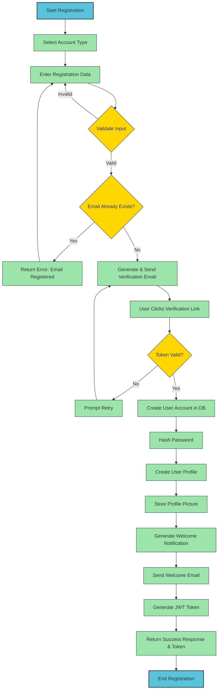

# Airbnb Clone Backend Workflow Flowcharts

This directory contains flowcharts that visualize the key backend processes of the Airbnb Clone application. These flowcharts illustrate the step-by-step workflow and data flow for critical backend features.

## User Registration Process Flowchart

The `user_registration_flowchart.png` file in this directory provides a detailed visualization of the user registration process in the Airbnb Clone backend system.

### Overview of User Registration Process

User registration is a critical process that allows new users to create accounts on the platform as either guests (who book properties) or hosts (who list properties). The process involves several steps including data collection, validation, storage, and notification.

### Process Steps

The user registration process follows these key steps:

1. **User Initiates Registration**
   - User navigates to registration page
   - User selects account type (Guest or Host)

2. **Data Collection**
   - User provides required information:
     - Email address
     - Password
     - Full name
     - Phone number (optional)
     - Profile picture (optional)
     - Account type-specific information

3. **Input Validation**
   - System validates email format
   - System checks if email already exists
   - System validates password strength
   - System validates other required fields

4. **Email Verification**
   - System generates verification token
   - System sends verification email
   - User clicks verification link
   - System validates token

5. **Account Creation**
   - System hashes password
   - System creates user record in database
   - System assigns appropriate role/permissions

6. **Profile Setup**
   - System creates user profile
   - System stores profile information
   - System processes and stores profile picture (if provided)

7. **Welcome Notification**
   - System generates welcome notification
   - System sends welcome email
   - System displays welcome message in-app

8. **Authentication**
   - System generates JWT token
   - System returns token to client
   - User is logged in automatically

### Data Flow

The user registration process involves the following data flows:

1. **Input Data**
   - Registration form data from user
   - Email verification token response

2. **Output Data**
   - Validation error messages (if any)
   - Verification email
   - Welcome notification
   - Authentication token

3. **Data Storage**
   - User credentials in Users database
   - User profile in Users database
   - Profile picture in Media storage
   - Notification in Notifications database

### Decision Points

The flowchart includes several decision points:

1. **Input Validation Check**
   - If validation fails: Return error messages
   - If validation passes: Proceed to email verification

2. **Email Existence Check**
   - If email exists: Return "Email already registered" error
   - If email doesn't exist: Proceed with registration

3. **Email Verification Check**
   - If verification fails: Prompt user to retry
   - If verification succeeds: Create account

4. **Account Type Selection**
   - If Guest: Set up guest-specific profile fields
   - If Host: Set up host-specific profile fields

### Error Handling

The registration process includes error handling for:

1. **Validation Errors**
   - Invalid email format
   - Weak password
   - Missing required fields
   - Email already registered

2. **Verification Errors**
   - Invalid verification token
   - Expired verification token
   - Failed email delivery

3. **Database Errors**
   - Failed to create user record
   - Failed to create profile record
   - Failed to store profile picture

### Security Considerations

The registration process implements several security measures:

1. **Password Security**
   - Password strength validation
   - Password hashing (not storing plaintext passwords)
   - Secure password reset mechanism

2. **Email Verification**
   - Preventing fake accounts through email verification
   - Time-limited verification tokens
   - Secure token generation

3. **Data Protection**
   - Input sanitization to prevent injection attacks
   - Rate limiting to prevent brute force attacks
   - HTTPS for secure data transmission

### Integration Points

The registration process integrates with several system components:

1. **Database System**
   - Users table
   - Profiles table

2. **File Storage System**
   - For storing profile pictures

3. **Email Service**
   - For sending verification emails
   - For sending welcome emails

4. **Notification System**
   - For generating in-app notifications

5. **Authentication System**
   - For generating JWT tokens
   - For setting up user sessions

## ASCII Representation of User Registration Flowchart

Below is an ASCII representation of the user registration flowchart:

```
+-------------------+
| Start Registration|
+-------------------+
          |
          v
+-------------------+
|  Select Account   |
|  Type (Guest/Host)|
+-------------------+
          |
          v
+-------------------+
| Enter Registration|
|       Data        |
+-------------------+
          |
          v
+-------------------+
|  Validate Input   |<-------+
+-------------------+        |
          |                  |
          v                  |
      /       \              |
     /  Valid  \    No       |
    <   Input?  >------------+
     \         /
      \       /
          | Yes
          v
+-------------------+
|   Check Email     |
|    Existence      |
+-------------------+
          |
          v
      /       \
     /  Email  \    Yes    +-------------------+
    < Already   >--------->| Return Error:     |
     \ Exists? /           | Email Registered  |
      \       /            +-------------------+
          | No
          v
+-------------------+
|  Generate & Send  |
| Verification Email|
+-------------------+
          |
          v
+-------------------+
|  User Clicks      |
| Verification Link |
+-------------------+
          |
          v
      /       \
     / Token   \    No     +-------------------+
    <  Valid?   >--------->| Prompt Retry      |
     \         /           +-------------------+
      \       /
          | Yes
          v
+-------------------+
|  Create User      |
|  Account in DB    |
+-------------------+
          |
          v
+-------------------+
|  Hash Password    |
+-------------------+
          |
          v
+-------------------+
|  Create User      |
|  Profile          |
+-------------------+
          |
          v
+-------------------+
|  Store Profile    |
|  Picture (if any) |
+-------------------+
          |
          v
+-------------------+
|  Generate Welcome |
|  Notification     |
+-------------------+
          |
          v
+-------------------+
|  Send Welcome     |
|  Email            |
+-------------------+
          |
          v
+-------------------+
|  Generate JWT     |
|  Token            |
+-------------------+
          |
          v
+-------------------+
|  Return Success   |
|  Response & Token |
+-------------------+
          |
          v
+-------------------+
|  End Registration |
+-------------------+
```

## Mermaid Diagram Script

Below is a Mermaid script that can be used to generate an interactive flowchart for the user registration process:



## How to Create the Flowchart in Draw.io

To create the user registration flowchart in Draw.io:

1. Go to https://app.diagrams.net/ (Draw.io)
2. Create a new diagram, selecting "Flowchart" as the template
3. Use the following shapes:
   - Rounded rectangles for start/end points
   - Rectangles for process steps
   - Diamonds for decision points
   - Arrows for flow direction
4. Follow the structure shown in the ASCII representation and Mermaid diagram
5. Use consistent colors to differentiate between:
   - Start/End points
   - Process steps
   - Decision points
   - Error handling steps
6. Add clear labels to all shapes and arrows
7. Export as PNG file named "user_registration_flowchart.png"

## Implementation Notes

When implementing the user registration process based on this flowchart:

1. **Validation Logic**
   - Implement comprehensive input validation on both client and server sides
   - Use regular expressions for email format validation
   - Implement password strength requirements (length, complexity)

2. **Email Verification**
   - Generate secure, time-limited tokens
   - Store tokens securely
   - Implement token verification logic

3. **Database Operations**
   - Implement proper error handling for database operations
   - Use transactions where appropriate
   - Ensure proper indexing for email lookups

4. **Security Measures**
   - Implement proper password hashing (e.g., bcrypt)
   - Sanitize all user inputs
   - Implement rate limiting for registration attempts

5. **User Experience**
   - Provide clear error messages
   - Implement progress indicators
   - Allow users to resend verification emails
