# Airbnb Clone Use Case Diagram

This directory contains a use case diagram that visualizes the interactions between users and the Airbnb Clone system. The diagram illustrates how different actors interact with the system's key functionalities.

## Overview

The use case diagram provides a visual representation of:
- The primary actors in the system
- The main use cases (system functionalities)
- The relationships between actors and use cases
- The relationships between use cases (include, extend, etc.)

## ASCII Representation

Below is an ASCII representation of the Airbnb Clone use case diagram:

```
+----------------------------------------------------------------------------------------------------------+
|                                      AIRBNB CLONE USE CASE DIAGRAM                                      |
+----------------------------------------------------------------------------------------------------------+

+----------------------------------------------------------------------------------------------------------+
|                                           AIRBNB CLONE SYSTEM                                            |
|                                                                                                          |
|  +------------------------+    +------------------------+    +------------------------+                   |
|  |   USER MANAGEMENT     |    |  PROPERTY MANAGEMENT   |    |   SEARCH & BOOKING    |                   |
|  +------------------------+    +------------------------+    +------------------------+                   |
|  | - Register Account     |    | - Create Listing      |    | - Search Properties   |                   |
|  | - Login/Authenticate   |    | - Edit Listing        |    | - Filter Results      |                   |
|  | - Manage Profile       |    | - Delete Listing      |    | - View Property       |                   |
|  | - Recover Password     |    | - Manage Availability |    | - Book Property       |                   |
|  +------------------------+    | - Upload Images       |    | - Cancel Booking      |                   |
|                                +------------------------+    | - View Booking History|                   |
|                                                              +------------------------+                   |
|                                                                                                          |
|  +------------------------+    +------------------------+    +------------------------+                   |
|  |  REVIEWS & RATINGS    |    |  PAYMENT PROCESSING   |    |    NOTIFICATIONS      |                   |
|  +------------------------+    +------------------------+    +------------------------+                   |
|  | - Leave Review        |    | - Process Payment     |    | - Booking Confirmation|                   |
|  | - Respond to Review   |    | - Issue Refund        |    | - Booking Cancellation|                   |
|  | - Rate Property       |    | - Manage Host Payout  |    | - Payment Notification|                   |
|  +------------------------+    +------------------------+    +------------------------+                   |
|                                                                                                          |
|  +------------------------+                                                                              |
|  |   ADMIN FUNCTIONS     |                                                                              |
|  +------------------------+                                                                              |
|  | - Manage Users        |                                                                              |
|  | - Manage Listings     |                                                                              |
|  | - Manage Bookings     |                                                                              |
|  | - Monitor Payments    |                                                                              |
|  | - Generate Reports    |                                                                              |
|  +------------------------+                                                                              |
|                                                                                                          |
+----------------------------------------------------------------------------------------------------------+

                 ^                      ^                      ^                      ^                      ^
                 |                      |                      |                      |                      |
                 |                      |                      |                      |                      |
                 |                      |                      |                      |                      |
                 |                      |                      |                      |                      |
+----------------+---+      +----------+----------+      +----+---------+      +-----+------+      +--------+-----+
|   GUEST USER       |      |     HOST USER       |      |    ADMIN     |      |  PAYMENT   |      | EMAIL       |
|                    |      |                     |      |              |      |  SYSTEM    |      | SERVICE     |
+--------------------+      +---------------------+      +--------------+      +------------+      +--------------+
```

## Actors

The diagram identifies the following key actors:

1. **Guest User** - Users who browse listings and make bookings
2. **Host User** - Users who create and manage property listings
3. **Admin** - System administrators who manage the platform
4. **Payment System** - External payment processing services
5. **Email Service** - External email notification services

## Key Use Cases

The diagram illustrates the following key use cases:

### User Management
- Register Account
- Login/Authenticate
- Manage Profile
- Recover Password

### Property Management (Host)
- Create Property Listing
- Edit Property Listing
- Delete Property Listing
- Manage Property Availability
- Upload Property Images

### Search and Booking (Guest)
- Search Properties
- Filter Search Results
- View Property Details
- Book Property
- Cancel Booking
- View Booking History

### Reviews and Ratings
- Leave Property Review
- Respond to Review
- Rate Property

### Payment Processing
- Process Payment
- Issue Refund
- Manage Payout to Host

### Notifications
- Receive Booking Confirmation
- Receive Booking Cancellation
- Receive Payment Notification

### Admin Functions
- Manage Users
- Manage Listings
- Manage Bookings
- Monitor Payments
- Generate Reports

## Relationships

The diagram shows several types of relationships:
- **Association** - Basic relationship between actor and use case
- **Include** - One use case includes functionality from another use case
- **Extend** - One use case may extend another under certain conditions
- **Generalization** - Inheritance relationship between use cases or actors

## How to Use This Diagram

This use case diagram serves as a reference for developers to understand:
- The system's scope and boundaries
- The main functionalities that need to be implemented
- How users will interact with the system
- The relationships between different system functionalities

The PNG file `airbnb_clone_use_case.png` can be viewed in any image viewer. If you need to modify the diagram, you can import it into Draw.io or any other UML diagramming tool.

## Mermaid Diagram Script

Below is a Mermaid script that can be used to generate an interactive use case diagram:

```mermaid
graph TD
    %% Define actors
    Guest[Guest User]
    Host[Host User]
    Admin[Admin]
    Payment[Payment System]
    Email[Email Service]

    %% Define system boundary
    subgraph Airbnb Clone System
        %% User Management
        Register[Register Account]
        Login[Login/Authenticate]
        ManageProfile[Manage Profile]
        RecoverPassword[Recover Password]

        %% Property Management
        CreateListing[Create Property Listing]
        EditListing[Edit Property Listing]
        DeleteListing[Delete Property Listing]
        ManageAvailability[Manage Property Availability]
        UploadImages[Upload Property Images]

        %% Search and Booking
        Search[Search Properties]
        Filter[Filter Search Results]
        ViewProperty[View Property Details]
        Book[Book Property]
        CancelBooking[Cancel Booking]
        ViewBookings[View Booking History]

        %% Reviews and Ratings
        LeaveReview[Leave Property Review]
        RespondReview[Respond to Review]
        RateProperty[Rate Property]

        %% Payment Processing
        ProcessPayment[Process Payment]
        IssueRefund[Issue Refund]
        ManagePayout[Manage Payout to Host]

        %% Notifications
        ReceiveConfirmation[Receive Booking Confirmation]
        ReceiveCancellation[Receive Booking Cancellation]
        ReceivePaymentNotif[Receive Payment Notification]

        %% Admin Functions
        ManageUsers[Manage Users]
        ManageListings[Manage Listings]
        ManageBookings[Manage Bookings]
        MonitorPayments[Monitor Payments]
        GenerateReports[Generate Reports]
    end

    %% Define key relationships between actors and use cases

    %% Guest User relationships
    Guest --> Register
    Guest --> Login
    Guest --> Search
    Guest --> Book
    Guest --> LeaveReview

    %% Host User relationships
    Host --> Register
    Host --> Login
    Host --> CreateListing
    Host --> ManageAvailability
    Host --> RespondReview

    %% Admin relationships
    Admin --> Login
    Admin --> ManageUsers
    Admin --> ManageListings
    Admin --> MonitorPayments

    %% Payment System relationships
    Payment --> ProcessPayment

    %% Email Service relationships
    Email --> ReceiveConfirmation
```



### How to Use the Mermaid Diagram

1. Copy the entire Mermaid script above (including the ```mermaid and ``` tags)
2. Go to the Mermaid Live Editor: https://mermaid.live/
3. Paste the script into the editor
4. The diagram will be rendered automatically
5. You can customize colors, styles, and layout as needed
6. Export as PNG or SVG when you're satisfied with the result

## Creating the Diagram

The diagram was created using Draw.io with the following steps:
1. Identify all actors that interact with the system
2. Identify all use cases (system functionalities)
3. Establish relationships between actors and use cases
4. Establish relationships between use cases
5. Organize the diagram for clarity and readability
6. Export as PNG for documentation purposes

## Implementation Considerations

When implementing the system based on this use case diagram, consider:
- Each use case may translate to one or more API endpoints
- Authentication and authorization requirements for each use case
- Data validation requirements
- Error handling scenarios
- Performance considerations for frequently used use cases
